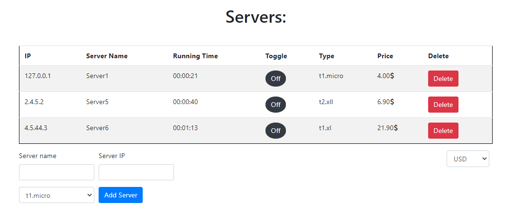

# serversManagement

Servers Management application allows supervision and management of servers.
 

<ins>Possible to:</ins>
* Add a server
* Delete a server
* Turn on/Turn off server run.
* See the price and the run time in real time, updating any 10 seconds. (price by server type)
* Change the currency - USD/EUR/ILS

Frontend: React & Bootstrap  
Backend: NodeJS & Express   
Database: MySQL.
 

<kbd></kbd>
